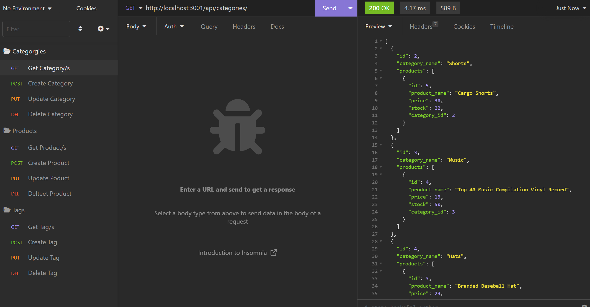

# eCommerce
eCommerce backend api 

## Description

This is a backend api that lets the user find one, find all, create, update and delete from three tables: Categories, Products and Tags using the command line and insomnia.

## Usage

Used in the terminal to start the program and then run in insomnia as shown in the demonstration video and screenshot provided below.

## Credit

Lukas Durkin & the great help I got from Leif and Fred

## Demo Video Link

https://drive.google.com/file/d/1lXmIJZ4csdI4rn0v4qlM4WDLRyNp8vk_/